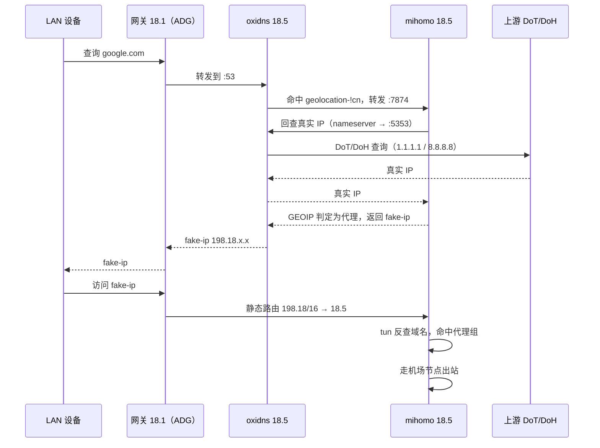
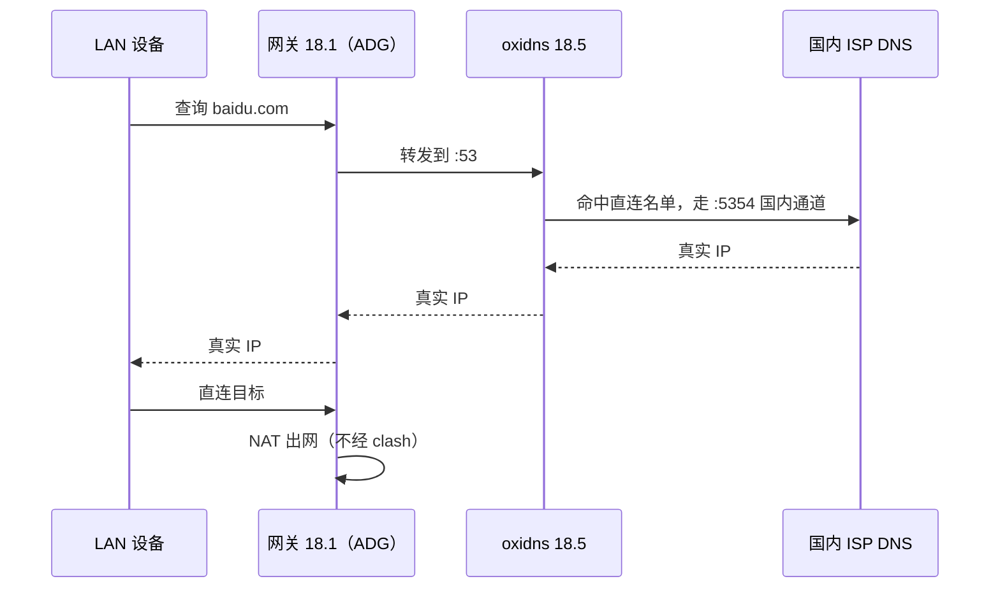
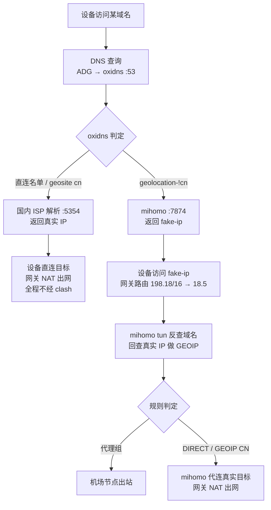

# oxidns + mihomo 做家庭 DNS 分流：配置文件详解

## 这套方案解决什么问题

设备一多，代理就难管。每台设备各挂各的客户端，配置分散，电视和 IoT 设备没法配。把决策集中到一台机器：设备只认一个 DNS、一个默认网关，该直连的直连，该翻墙的翻墙。

方案里两个角色跑在同一台机器上：oxidns 管 DNS 分流，mihomo（clash 核心）管流量出口。oxidns 是 mosdns 的重构版，配置是 YAML。下面按实际运行配置逐段拆解，照抄改改就能跑。

## 角色分工

oxidns 监听 53 端口收全家的 DNS 查询，按 geosite 名单判断域名归属：geosite cn 和直连名单里的域名，交给国内 ISP 的 DNS 解析，返回真实 IP；geolocation-!cn 的域名，转发给 mihomo 拿 fake-ip。mihomo 应答 fake-ip，接收 fake-ip 段流量，按规则出去。

## oxidns 配置

### 判定名单

geoip 和 geosite 数据来自 Loyalsoldier 的 v2ray-rules-dat，启动时缺了自动下载，之后每 12 小时刷新：

```yaml
plugins:
  - tag: geoip_private
    type: geoip
    args: { file: ./data/geoip.dat, selectors: [private] }
  - tag: geoip_cn
    type: geoip
    args: { file: ./data/geoip.dat, selectors: [cn] }
  - tag: geosite_cn
    type: geosite
    args: { file: ./data/geosite.dat, selectors: [cn, china-list, apple-cn, google-cn] }
  - tag: geosite_noncn
    type: geosite
    args: { file: ./data/geosite.dat, selectors: [geolocation-!cn] }

  - tag: data_download
    type: download
    args:
      timeout: 60s
      startup_if_missing: true
      downloads:
        - url: "https://cdn.jsdelivr.net/gh/Loyalsoldier/v2ray-rules-dat@release/geoip.dat"
          dir: "./data"
          filename: "geoip.dat"
        - url: "https://cdn.jsdelivr.net/gh/Loyalsoldier/v2ray-rules-dat@release/geosite.dat"
          dir: "./data"
          filename: "geosite.dat"
        - url: "https://cdn.jsdelivr.net/gh/asterwyx/direct@main/direct-list.txt"
          dir: "./data"
          filename: "asterwyx.txt"
```

### 直连名单和代理名单

直连名单由三部分拼成：geosite cn 打底，加上社区直连列表和自己按需补充的域名。代理名单同理，geosite noncn 打底，再补自己需要的：

```yaml
  - tag: domain_direct
    type: domain_set
    args:
      exps:
        - za.group               # 自补充的直连域名
        - argotunnel.com
        - openrouter.ai
        - integrate.api.nvidia.com
      files:
        - ./data/asterwyx.txt    # 社区直连列表
      sets:
        - geosite_cn

  - tag: domain_proxy
    type: domain_set
    args:
      exps:
        - kubevirt.io            # 自补充的代理域名
        - regexp:^[^.]+-docker\.pkg\.dev$
        - b.ai
      sets:
        - geosite_noncn
```

### 特殊域名

内网域名直答，不走任何上游。公司域名转发给公司内网 DNS。来自 Tailscale 网段（100.64.0.0/10）的查询，把内网域名解析成 tailnet 入口地址，保证从外面访问家里服务时走隧道：

```yaml
  - tag: hosts_home
    type: hosts
    args:
      entries:
        - regexp:.+\.example\.home 192.168.18.31   # 内网服务统一入口

  - tag: hosts_tailscale
    type: hosts
    args:
      entries:
        - regexp:.+\.example\.home 100.111.89.100  # tailnet 入口

  - tag: domain_deepin
    type: domain_set
    args:
      exps:
        - regexp:.+\.example-corp\.com             # 公司内网域名
```

### 上游

国外通道全部是 IP 型 DoT/DoH。为什么必须是 IP 型，后面单独讲：

```yaml
  - tag: forward_foreign
    type: forward
    args:
      concurrent: 3
      upstreams:
        - addr: https://1.1.1.1/dns-query
          dial_addr: 1.1.1.1
          enable_http3: false
        - addr: tls://1.1.1.1
          enable_pipeline: true
        - addr: tls://8.8.8.8
          enable_pipeline: true
        - addr: https://45.11.104.186
          insecure_skip_verify: true
        - addr: tls://208.67.222.2
          enable_pipeline: true
        - addr: tls://208.67.222.222
          enable_pipeline: true
```

国内通道按运营商分两组，环境变量 WH_TELECOM / WH_UNICOM 切换：

```yaml
  - tag: forward_wh-telecom
    type: forward
    args:
      concurrent: 2
      upstreams:
        - addr: 202.103.24.68      # 武汉电信
        - addr: 202.103.44.150
  - tag: forward_wh-unicom
    type: forward
    args:
      concurrent: 2
      upstreams:
        - addr: 218.104.111.114    # 武汉联通
        - addr: 218.104.111.122
```

三个特殊上游，是方案对接的关键：

```yaml
  - tag: forward_local        # 本地域名，交给路由器
    type: forward
    args: { upstreams: [ { addr: 192.168.18.1:5353 } ] }
  - tag: forward_clash        # 国外域名，转 mihomo 拿 fake-ip
    type: forward
    args: { upstreams: [ { addr: 127.0.0.1:7874 } ] }
  - tag: forward_deepin       # 公司域名
    type: forward
    args: { upstreams: [ { addr: 10.20.0.10 } ] }
```

公网查询带缓存，13 万条，懒加载 TTL 一天：

```yaml
  - tag: cache_wan
    type: cache
    args: { size: 131072, lazy_cache_ttl: 86400 }
```

### 查询处理链

先看五个查询序列，处理链引用的就是它们：

```yaml
  - tag: query_foreign       # 国外：缓存优先，然后 DoT/DoH
    args: [query_summary foreign, $cache_wan, jump has_resp_seq, $forward_foreign, jump has_resp_seq]
  - tag: query_isp           # 国内：缓存优先，然后按运营商
    args: [query_summary isp, $cache_wan, jump has_resp_seq, env WH_TELECOM -> $forward_wh-telecom, env WH_UNICOM -> $forward_wh-unicom, jump has_resp_seq]
  - tag: query_clash         # 转 mihomo
    args: [query_summary clash, $forward_clash, jump has_resp_seq]
  - tag: query_lan           # 本地，转路由器
    args: [query_summary lan, $forward_local, jump has_resp_seq]
  - tag: query_deepin        # 公司
    args: [query_summary company, $forward_deepin, jump has_resp_seq]
```

三段处理链，顺序执行：

```yaml
  - tag: pre_sequence
    args:
      - client_ip 100.64.0.0/10        # Tailscale 来源的查询
        -> jump query_tailscale
      - qtype 65 / qname 含关键字       # HTTPS 记录和关键字查询直接拒
        -> $reject_3
      - qtype 12 / qtype 255 / .lan .local .arpa
        -> jump query_lan
      - _vlmcs._tcp.lan. SRV           # 局域网 KMS 发现
        -> $kms_srv
      - $hosts_home                    # 内网域名直答
      - qname $domain_deepin
        -> jump query_deepin

  - tag: main_sequence
    args:
      - qname $domain_direct 且非 $domain_proxy
        -> jump query_isp              # 直连名单 → 国内 ISP → 真实 IP
      - qname $domain_proxy
        -> jump query_clash            # 代理名单 → mihomo → fake-ip

  - tag: fallback_sequence
    args:
      - $query_foreign                 # 兜底：先国外解析
      - 结果 private -> query_lan
      - 结果 geoip cn -> query_isp
      - 其他 -> query_clash
```

监听端口，三种身份：

```yaml
  - tag: udp_server_main
    type: udp_server
    args: { entry: sequence, listen: :53 }
  - tag: tcp_server_main
    type: tcp_server
    args: { entry: sequence, listen: :53 }
  - tag: udp_server_foreign
    type: udp_server
    args: { entry: query_foreign, listen: :5353 }
  - tag: tcp_server_foreign
    type: tcp_server
    args: { entry: query_foreign, listen: :5353 }
  - tag: udp_server_isp
    type: udp_server
    args: { entry: query_isp, listen: :5354 }
  - tag: tcp_server_isp
    type: tcp_server
    args: { entry: query_isp, listen: :5354 }
```

53 是主入口，5353 国外通道，5354 国内通道。后两个端口双重身份：对内是 oxidns 自己的分流通道，对外是 mihomo 的解析上游。

## mihomo 怎么配合

mihomo 的完整配置里，和 oxidns 对接的只有 DNS 段：

```yaml
dns:
  enable: true
  listen: 0.0.0.0:7874
  enhanced-mode: fake-ip
  fake-ip-range: 198.18.0.1/16
  fake-ip-ttl: 300

  nameserver:             # 回查 oxidns 国外通道拿真实 IP
    - 127.0.0.1:5353
  direct-nameserver:      # 回查 oxidns 国内通道拿真实 IP
    - 127.0.0.1:5354
```

对应关系固定：nameserver 指 5353 国外通道，direct-nameserver 指 5354 国内通道，写反会导致代理侧域名被国内 DNS 解析。

fake-ip-filter 里放音乐、时间同步、微软、苹果和游戏这些必须拿真实 IP 的域名，避免 fake-ip 破坏服务：

```yaml
  fake-ip-filter:
    - '*.lan'
    - '+.pool.ntp.org'
    - 'time.*.com'
    - '*.msftconnecttest.com'
    - 'mesu.apple.com'
    - '+.srv.nintendo.net'
    - '*.music.163.com'
    - 'y.qq.com'
```

tun 和基础项：

```yaml
tun:
  enable: true
  stack: system

mixed-port: 7893
allow-lan: true
mode: rule
external-controller: 192.168.18.5:9090
```

规则组织方式和一般 clash 配置没有区别：订阅 provider、应用规则组，GEOIP LAN/CN 直连和 MATCH 兜底，这里不展开。

## 两者怎么接起来

oxidns 把国外域名查询转发给 mihomo 的 7874 端口。mihomo 收到后要先判断这个域名该走代理还是直连，用 nameserver（127.0.0.1:5353，oxidns 国外通道）或 direct-nameserver（127.0.0.1:5354，oxidns 国内通道）回查 oxidns 拿真实 IP，做 GEOIP 判断。判为代理的返回 fake-ip 给 oxidns，判为直连的返回真实 IP。fake-ip-filter 里的域名也是这一步拿真实 IP 返回。

设备访问 fake-ip，流量进 mihomo tun，反查回域名，用这次解析好的真实 IP 建连，走代理或直连。

这个环不会死锁，因为域名解析在整个链路里只发生一次。mihomo 回查 oxidns 拿真实 IP 之后，GEOIP 判断和后续建连全部基于 IP，不再需要域名解析，DNS 查询链到此终止。oxidns 的 5353/5354 通道直连 DoH/DoT 和国内 ISP 上游，也不会把查询再转回 mihomo。

### DNS 请求时序

国外域名（google.com），以 fake-ip 结尾：



国内域名（baidu.com），全程不碰 clash：



## 为什么必须住同一台机器

oxidns 的国外上游是 8.8.8.8、1.1.1.1 这类 DoT/DoH，目标 IP 都在国外。这些连接从 oxidns 发出，被同网络栈里 mihomo 的 tun 接住，GEOIP 一查是国外 IP，走机场出去。DNS 查询本身翻墙了，防污染、防阻断，不用配任何额外路由。

这个设计带出一个硬约束：上游只能配 IP 型 DoT/DoH，不能配域名型的。dns.google 这种域名要先解析才能连，解析又要查 DNS，查询又回到自己手里，死锁。要么 hosts 里写死它的 IP，要么全用 IP 型。上面配置里全是 IP 型，dial_addr 显式写出目标地址。oxidns 单独部署的话这些裸 DoT 连接出不去，方案不成立。

## 流量路径分三种

真实 IP 直连。DNS 阶段判了直连，返回真实 IP。设备直接和目标建连，网关 NAT，全程不经过 clash。

fake-ip 走代理。拿到 fake-ip 后设备访问它，网关把 fake-ip 段路由到 mihomo，tun 接住，反查域名，规则命中代理组，从机场出站。

fake-ip 判直连。域名先拿了 fake-ip 进了 clash，但规则判了 DIRECT（Direct 规则集、GEOIP CN，或解析出的真实 IP 属于中国段），mihomo 自己向真实目标建连再原路回给设备。这类场景常见于挂了国内 CDN 的境外站点：域名不在 geosite cn，但 IP 归属在国内。域名名单判断不了 IP 归属，所以先发 fake-ip，把按 IP 裁决的权力留给 mihomo。域名层粗筛、IP 层精筛，这是这套方案的核心。

### 三种连接流程



## 复刻时最容易踩的坑

DoH 用域名型。写了 dns.google 这种上游，启动即死锁。全部用 IP 型，或者 hosts 写死。

fake-ip 段和内网段冲突。198.18.0.0/16 是文档保留段，拿来当 fake-ip 不会撞任何真实内网。别换成 10.x 或 172.16。

网关漏配路由。只配好 oxidns、静态路由没加，fake-ip 流量会烂在网关。先 dig @oxidns-ip 确认 DNS 通，再 curl 验证流量路径。

nameserver 和 direct-nameserver 写反。对应关系是 nameserver=5353 国外通道、direct-nameserver=5354 国内通道。

geosite 数据过期。靠 12 小时 cron 拉新，启动时拉不到会用旧文件。日志里看到下载失败先排查 oxidns 的出网。

oxidns 的 API 面板默认口令很弱，暴露公网前必须改。

## 收尾

整套方案两个配置文件，加上一套端口对应关系和一条静态路由。跑起来之后家里所有设备零配置，调整规则只动一处。
